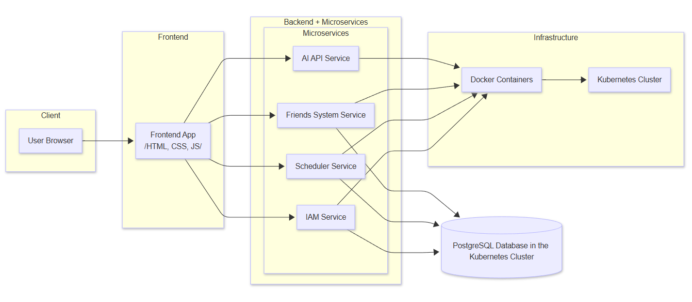
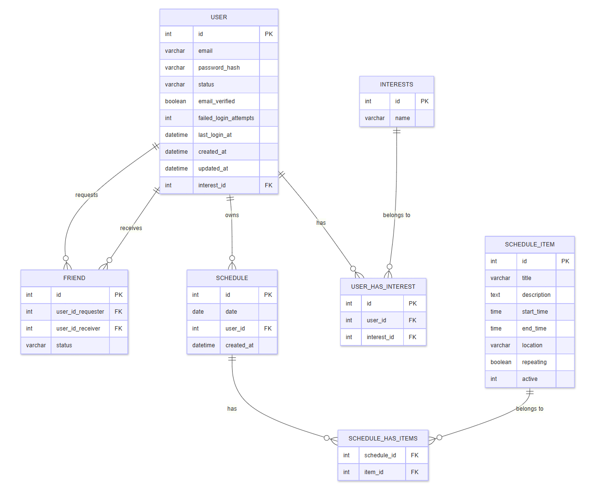
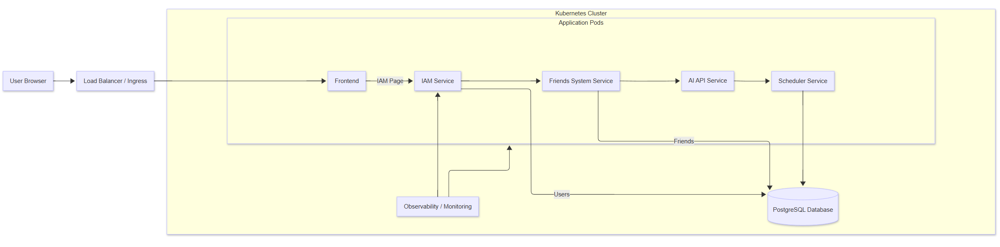

# Root-Square-Out-With-Friends

## Описание на проекта

PlannerMate е уеб-базирано приложение за планиране, което помага на потребителите да организират своето ежедневие, учебни сесии и социални ангажименти. Системата позволява създаване и управление на планови елементи, свързване с приятели и синхронизация с Google Calendar и Apple Calendar.

Архитектурата е микросървисна и включва следните основни компоненти: scheduler (основна бизнес логика), IAM сървис (автентикация и оторизация), friends сървис (управление на приятели) и PostgreSQL база данни.

---

## Архитектура на системата


---

## Файлова структура

```
ROOT-SQUARE-OUT-WITH-FRIENDS/
├── .github/
│   └── workflows/
│       ├── deploy-iam.yml
│       ├── deploy-friend.yml
│       └── deploy-scheduler.yml
├── diagrams/
├── plannermate-chart/
│   ├── charts/
│   │   ├── iam/
│   │   │   ├── templates/
│   │   │   │   ├── deployment.yaml
│   │   │   │   └── iam-service.yaml
│   │   │   ├── Chart.yaml
│   │   │   └── values.yaml
│   │   ├── postgres/
│   │   │   ├── templates/
│   │   │   │   ├── deployment.yaml
│   │   │   │   ├── pvc.yaml
│   │   │   │   └── service.yaml
│   │   │   ├── Chart.yaml
│   │   │   └── values.yaml
│   │   └── friend/
│   │       ├── templates/
│   │       │   ├── deployment.yaml
│   │       │   └── service.yaml
│   │       ├── Chart.yaml
│   │       └── values.yaml
│   ├── templates/
│   │   ├── deployment.yaml
│   │   ├── service.yaml
│   │   └── configmap.yaml
│   ├── extras/
│   │   ├── argocd-app.yaml
│   │   └── servicemonitor.yaml
│   ├── Chart.yaml
│   └── values.yaml
├── scheduler/
│   ├── src/
│   │   └── main/
│   │       ├── java/com/rootsquare/planmate/
│   │       │   ├── config/
│   │       │   ├── constants/
│   │       │   ├── controller/
│   │       │   ├── dto/
│   │       │   ├── exception/
│   │       │   ├── model/
│   │       │   ├── repository/
│   │       │   └── service/
│   │       └── resources/
│   │           ├── static/
│   │           └── application.properties
│   ├── Dockerfile
│   └── pom.xml
├── .gitignore
├── LICENSE
└── README.md
```

### Основни директории

| Директория | Описание |
|---|---|
| `.github/workflows` | CI/CD поток на приложението |
| `scheduler` | Главната директория на приложението (бизнес логика, REST API, frontend) |
| `plannermate-chart` | Helm chart на приложението |
| `plannermate-chart/charts/iam` | IAM подграфика (автентикация) |
| `plannermate-chart/charts/postgres` | PostgreSQL подграфика |
| `plannermate-chart/charts/friend` | Friends сървис подграфика |
| `plannermate-chart/extras` | ArgoCD и Prometheus конфигурации (прилагат се ръчно) |

---

## Tech Stack

| Компонент | Технология |
|---|---|
| Backend | Spring Boot / Maven (Java 21) |
| Frontend | Vanilla JavaScript, HTML, CSS |
| База данни | PostgreSQL 16 |
| Контейнеризация | Docker |
| Оркестрация | Kubernetes (Helm chart, CI/CD с GitHub Actions) |
| IAM | Spring Security + JWT (BCrypt) |
| GitOps | ArgoCD |
| Observability | Prometheus + ServiceMonitor |

---

## API Endpoints

### Сървиси

| Сървис | Порт | NodePort | Отговорност |
|---|---|---|---|
| scheduler (planmate) | 8081 | 30081 | Основна бизнес логика — планови елементи, REST API, frontend |
| iam-service | 8085 | 31913 | Автентикация и оторизация |
| friends-service | 8085 | 30082 | Управление на приятели |
| PostgreSQL | 5432 | — | Релационна база — потребителски данни, планови елементи |

### Scheduler API

| Method | Endpoint | Описание |
|---|---|---|
| GET | `/api/schedule-items` | Връща всички планови елементи |
| GET | `/api/schedule-items/{id}` | Връща конкретен елемент по ID |
| POST | `/api/schedule-items` | Създава нов планов елемент |
| PUT | `/api/schedule-items/{id}` | Редактира съществуващ елемент |
| DELETE | `/api/schedule-items/{id}` | Изтрива елемент |
| GET | `/api/schedule-items/{id}/google-calendar-url` | Генерира URL за Google Calendar |
| GET | `/api/schedule-items/{id}/apple-calendar` | Сваля .ics файл за Apple Calendar |

### IAM API

| Method | Endpoint | Достъп | Описание |
|---|---|---|---|
| POST | `/api/auth/register` | Публичен | Регистрация на нов потребител, връща JWT |
| POST | `/api/auth/login` | Публичен | Валидира данни, връща JWT |
| GET | `/api/users/me` | Authenticated | Профил на текущия потребител |
| POST | `/api/users/change-password` | Authenticated | Смяна на парола |
| GET | `/api/admin/users` | Admin | Списък с всички потребители |
| POST | `/api/admin/users/{id}/activate` | Admin | Активира акаунт |
| POST | `/api/admin/users/{id}/lock` | Admin | Заключва акаунт |
| DELETE | `/api/admin/users/{id}` | Admin | Изтрива акаунт |

---

## База данни

### Схема на базата



Проектът използва ORM (Hibernate / Spring Data JPA) за управление на взаимодействието между Java обектите и PostgreSQL базата данни.

### Модели

| Таблица | Описание |
|---|---|
| `schedule_items` | Планови елементи — заглавие, описание, дата, час, локация, повтарящ се, активен |
| `schedules` | Разписания — дата, потребителски ID, създаден на |
| `schedule_has_items` | Join таблица между `schedules` и `schedule_items` (Many-to-Many) |
| `users` | Потребители (IAM) — email, парола (BCrypt), роля, статус, неуспешни опити |
| `roles` | Роли на потребителите (IAM) |

### Връзки

- `Schedule` → `ScheduleItem`: Many-to-Many чрез `schedule_has_items`
- `Schedule.userId` → external (управлява се от IAM сървис, без FK constraint)
- Таблиците се създават автоматично при стартиране (`ddl-auto=update`)

---

## Инфраструктура

### Инфраструктурна диаграма



### Deployments

| Deployment | Replicas | Memory Request/Limit | CPU Request/Limit | Probe |
|---|---|---|---|---|
| planner (scheduler) | 1 | 256Mi / 512Mi | 250m / 500m | `/actuator/health` |
| planner-iam | 1 | 128Mi / 256Mi | 100m / 250m | TCP Socket :8085 |
| planner-frd | 1 | 128Mi / 256Mi | 100m / 250m | TCP Socket :8085 |
| planner-postgres | 1 | 128Mi / 256Mi | 100m / 250m | `pg_isready` |

### Services

| Сървис | Тип | Порт |
|---|---|---|
| planner-svc | NodePort | 8081 (NodePort: 30081) |
| planner-iam | NodePort | 8085 (NodePort: 31913) |
| planner-frd | ClusterIP | 8085 |
| postgres-service | ClusterIP | 5432 |

### Persistent Storage

PostgreSQL използва PersistentVolumeClaim (PVC) от 1Gi за съхранение на данни при рестарт на pod-а.

---

## Docker конфигурация

Dockerfile-ът използва multi-stage build за минимален образ:

```dockerfile
# Build Stage
FROM maven:3.9-eclipse-temurin-21 AS builder
WORKDIR /app
COPY scheduler/pom.xml .
RUN mvn dependency:go-offline -B
COPY scheduler/src ./src
RUN mvn clean package -DskipTests -B

# Run Stage
FROM eclipse-temurin:21-jre-alpine
WORKDIR /app
RUN addgroup -S planmate && adduser -S planmate -G planmate
COPY --from=builder /app/target/*.jar app.jar
RUN chown planmate:planmate app.jar
USER planmate
EXPOSE 8080
ENTRYPOINT ["java", "-jar", "app.jar"]
```

**Предимства:** Build образът (~700MB) се използва само за компилиране. Финалният образ е базиран на Alpine JRE (~100MB). Приложението се изпълнява като непривилегирован потребител.

---

## CI/CD Pipeline

### CI файлове

| Файл | Тригер | Описание |
|---|---|---|
| `.github/workflows/deploy-scheduler.yml` | Push към `main`, промени в `scheduler/` | Тества и deploy-ва scheduler сървиса |
| `.github/workflows/deploy-iam.yml` | Push към `main`, промени в `iam-service/` | Тества и deploy-ва IAM сървиса |
| `.github/workflows/deploy-friend.yml` | Push към `main`, промени в `friend-service/` | Тества и deploy-ва friends сървиса |

### Алгоритъм

При промяна в съответната директория се задейства потокът:
1. Checkout на кода
2. Настройка на JDK 21 (Temurin) с Maven кеш
3. Изпълнение на тестовете (`mvn test`)
4. При успех — trigger на Render deploy hook

### CD — ArgoCD

ArgoCD следи Git репозиторито и автоматично синхронизира Kubernetes Cluster-а с Helm chart-а:
- `prune: true` — премахва ресурси, изтрити от Git
- `selfHeal: true` — връща ръчни промени в Kubernetes към Git състоянието
- `CreateNamespace=true` — автоматично създава namespace-а

---

## Инструкции за стартиране

```bash
git clone https://github.com/viktorsirakov08/ROOT-SQUARE-OUT-WITH-FRIENDS.git
cd ROOT-SQUARE-OUT-WITH-FRIENDS
```

При успешно стартиран Kubernetes Cluster (напр. Docker Desktop):

```bash
# Създаване на namespace
kubectl create namespace planmate

# Database secret (не се commit-ва в Git)
kubectl create secret generic db-secret \
  --from-literal=url="jdbc:postgresql://postgres-service:5432/planmate" \
  --from-literal=username=<your-db-user> \
  --from-literal=password=<your-db-password> \
  -n planmate

# Инсталиране на Helm chart
helm install planner ./plannermate-chart -n planmate
```

За обновяване:

```bash
helm upgrade planner ./plannermate-chart -n planmate
```

За проверка на статуса:

```bash
kubectl get pods -n planmate
```

---

## Използвани AI инструменти

**Claude AI:**
- Генериране на Dockerfile и docker-compose конфигурации
- Дебъгване на Kubernetes и Helm грешки
- Навързване на сървисите и конфигуриране на secrets
- Генериране на Helm chart шаблони

---

## Заключение

- Успешно изградена микросървисна архитектура с три независими сървиса
- Придобит опит с Docker multi-stage builds и Kubernetes оркестрация
- Успешно интегриран IAM сървис с JWT автентикация
- Helm chart с подграфики за всеки сървис
- CI/CD pipeline с GitHub Actions и Render deploy hooks
- GitOps подход с ArgoCD конфигурация

---

## Източници

- https://spring.io/projects/spring-boot — Spring Boot
- https://kubernetes.io — Kubernetes документация
- https://helm.sh — Helm документация
- https://argoproj.github.io — ArgoCD
- https://docs.github.com/en/actions — GitHub Actions
- https://render.com — Render (CD платформа)
